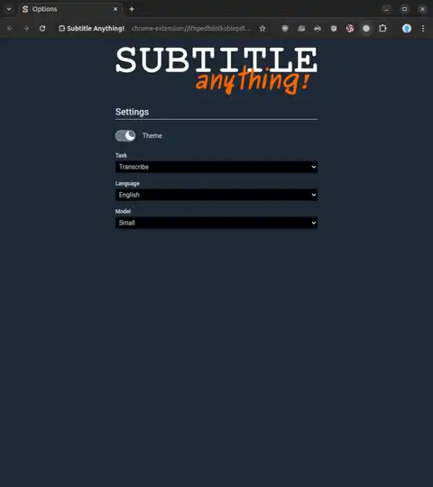

*Note: This is an early access Chrome extension that must be installed in development mode only! Expect changes and bug fixes.*

 

 

 

Add AI generated subtitles to any video (or audio) playing in your browser!

Subtitle Anything is:

1. **Free:**
*No "free trial then monthly payment". If your device supports it, you can run it forever. Free.*

2. **Private:**
*No data leaves your device. Subtitle Anything doesn't run translations on Google's (or any other) servers.*

3. **Flexible**
*No site specific support: One extension. Any tab that plays audio. 99 languages plus autodetect.*

 

**Check out the docs! [subtitle-anything.com](https://www.subtitle-anything.com)**

 

 

If you find Subtitle Anything useful and would like to see it brought to your browser's extension store, or to have new features, please show your support by leaving a star.

Every star is appreciated! ⭐
